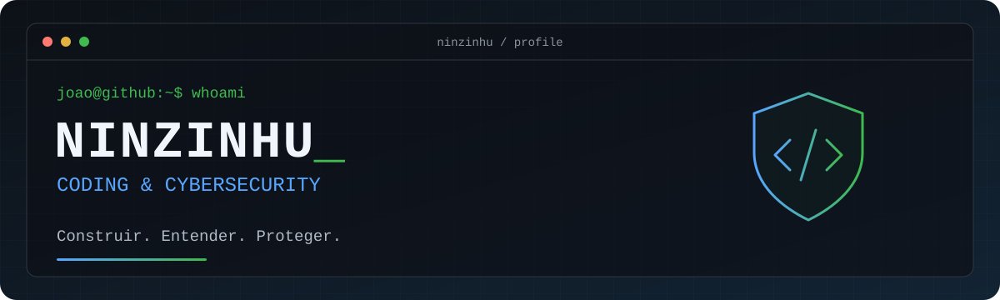
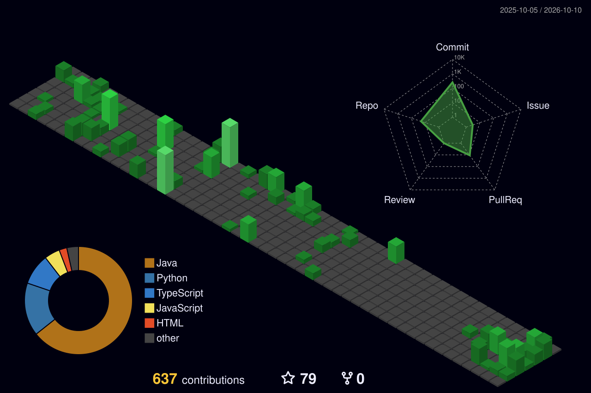

  
    
  
  
  
  

  <h3>Código por curiosidade. Segurança por princípio.</h3>
  
Desenvolvimento de software, sistemas em nuvem e um olhar atento à segurança.

  
  

---

## 👾 / sobre mim

Sou **João Victor Emmanuell**, também conhecido como **Ninzinhu**, estudante de **Sistemas de Informação na [Estácio](https://estacio.br/cursos/graduacao)**.

Gosto de entender o que acontece além da interface: como o código se organiza, como os sistemas se comunicam e onde a segurança entra em cada decisão. Meu foco reúne **desenvolvimento, cloud e cibersegurança**, com espaço para experimentar e aprender construindo.

- **Construir:** aplicações, plugins e integrações — incluindo projetos em Java para jogos.
- **Entender:** arquitetura, APIs, infraestrutura e o caminho dos dados entre sistemas.
- **Proteger:** explorar segurança de aplicações e práticas de desenvolvimento seguro.
- **Desconectar:** academia, cultura japonesa e idioma japonês.

## ⚡ / tecnologias

Meu universo de desenvolvimento e estudos, organizado por área.

### Backend & frameworks

  

  
  
  

**Java · Go · Kotlin · .NET · ASP.NET · Quarkus · Node.js · Express**

### Frontend & mobile

**Next.js · React · Vue · Swift**

### Cloud & ambiente

**AWS · Microsoft Azure · Google Cloud · Docker · Linux**

### Dados & ferramentas

**PostgreSQL · MongoDB · Git · Postman**

## 🛡️ / security mindset

  
  
  
  

Áreas de interesse que conectam minha curiosidade por segurança ao código que quero construir:

| Camada | O que quero aprofundar |
| :--- | :--- |
| **Aplicações** | Autenticação, autorização, validação de entradas e proteção de dados. |
| **Código** | Revisão, dependências, tratamento de erros e prevenção de vulnerabilidades. |
| **Infraestrutura** | Permissões, configuração de serviços e segurança em ambientes cloud. |
| **Redes** | Protocolos, comunicação entre aplicações e análise de tráfego. |

## 🚀 / projetos em destaque

### [ChestCommands ↗](https://github.com/Ninzinhu/ChestCommands)

Sistema de menus configuráveis para **Hytale**, com separação entre core, API e integração com o servidor. Um projeto para explorar organização de código e integração entre plugins.

  

### [KonpekiEconomy ↗](https://github.com/Ninzinhu/KonpekiEconomy)

Plugin de **economia para Hytale**, parte dos meus projetos de desenvolvimento para jogos.

  

**[Ver todos os repositórios →](https://github.com/Ninzinhu?tab=repositories)**

## 🌃 / mapa de contribuições

Um registro visual da minha atividade no GitHub.

  

---

  <h3>Uma boa conversa pode virar um bom projeto.</h3>
  
Código, cloud, segurança ou uma ideia para construir juntos.

  
    
  Aprender com curiosidade. Construir com intenção. Evoluir sempre.

