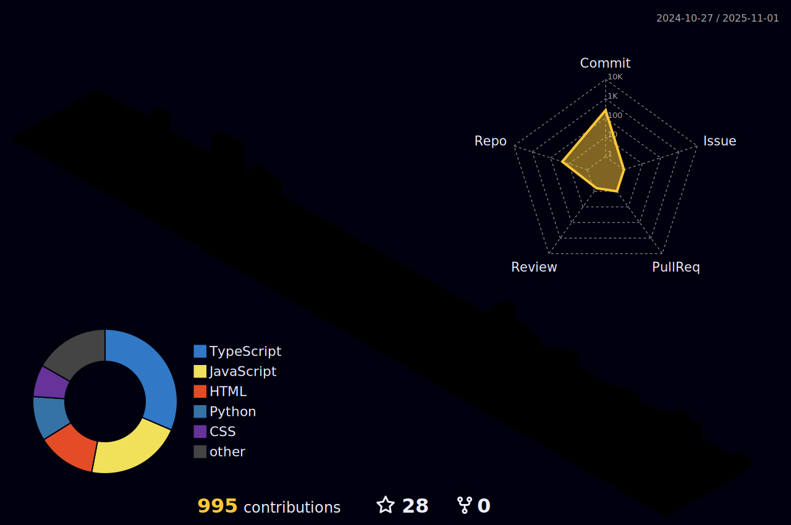

<!---### Hi, I'm João! 👋 --->

  

 

 
  

## About me
I'm a student of Information Systems at Estácio University [Estácio](https://estacio.br/cursos/graduacao).   Community is :heart:. 
 

## Things I am passionate about.
- Gym 🏋🏻
- Code👩🏻‍💻
- Money💸
- Japanese Culture and Language 🇯🇵
 

<table align="center">
  <tr>
    <td align="center">
      
    </td>
    <td align="center">
      
    </td>
  </tr>
</table>

  ###

  

<!----  
 !-->

## Tech Stack:

   

  

<!--
  -->

<!--- 

 --->

<!----

 --->

 
 

 
##
   

     
  

<!----[snake gif](https://github.com/ninzinhu/ninzinhu/blob/output/github-contribution-grid-snake.svg)
  
 --->
